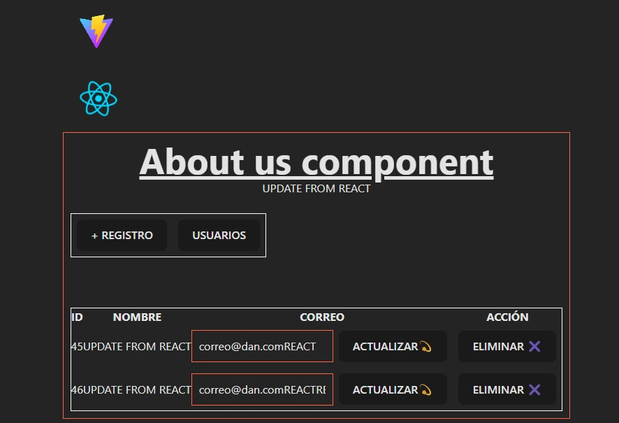

# React + Vite CRUD

Connection to Laravel Lume (MySQL)

## Script
npm create vite@latest my-app -- --template react

cd my-app

npm install
npm run dev
npm run dev --host 172.18.16.1:3000
npm run dev --host 192.168.100.32

## Axios for requests

npm install axios
https://www.freecodecamp.org/espanol/news/como-usar-axios-con-react/

## Axios for requests
2 Correr en localhost

## Tailwind
npm install tailwindcss @tailwindcss/vite
import tailwindcss from '@tailwindcss/vite'
export default defineConfig({
  plugins: [
    tailwindcss(),
  ],
})

@import "tailwindcss";

### Documentacion

https://react.dev/learn/build-a-react-app-from-scratch

https://stackoverflow.com/questions/76074040/vite-server-is-running-on-127-0-0-1-by-default-instead-of-localhost

https://www.freecodecamp.org/espanol/news/react-crud-app-tutorial-como-construir-una-aplicacion-de-administracion-de-libros-en-react-desde-cero/

https://tailwindcss.com/docs/installation/using-vite

#### Lo learn

https://egghead.io/lessons/typescript-create-a-new-next-js-and-typescript-project

https://github.com/nikolovlazar/egghead-beginners-guide-nextjs/tree/main#

https://egghead.io/lessons/react-redux-the-single-immutable-state-tree

#### Redux
https://redux.js.org/tutorials/quick-start
https://redux.js.org/tutorials/essentials/part-1-overview-concepts

https://codesandbox.io/p/sandbox/github/reduxjs/redux/tree/master/examples/todos?file=%2Fsrc%2Findex.js%3A16%2C1&from-embed

## Redux
State manager

npm install @reduxjs/toolkit
npm install react-redux
npm install @reduxjs/toolkit react-redux

## Router
## Next js

## Others
 - Modify vite.config.js file in order to run localhost to IP Address
